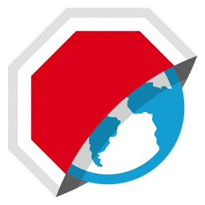

---?color=#020203
@title[Introduction]

@transition[none]

@snap[west]

@snapend

@snap[east]
@size[2em](NEW @color[#e49436](KIDS) IN @color[#e49436](BROWSER)LAND)
  
@fa[plug] Supercharge your web apps using the new browser APIs @fa[bolt]
@snapend

---?color=black

@snap[west]
@css[bio-about](Software Engineer at Meesho Obsessed with Sindre's `awesome` lists)
   
@fa[terminal fa-3x bio-fa](geek)
   
@css[bio-about](Open Source Contributor at Night Co-Organizer at Vue Bangalore)
@snapend

@snap[east bio]
@css[bio-headline](Swapnil Agarwal)
 
@css[bio-byline](@fa[github pad-fa] swapagarwal @fa[twitter pad-fa])
 

 
@css[bio-tagline](The swag guy! devswag.io)
@snapend

---

## Sneak Peek

- Intersection Observer API
- Credential Management API
- Network Information API
- Web Share API
- Device Memory API
- Concurrent Hardware API
- Payment Request API

---?include=template/md/intersection-observer/PITCHME.md

---?include=template/md/credential-management/PITCHME.md

---?include=template/md/network-information/PITCHME.md

---?include=template/md/web-share/PITCHME.md

---?include=template/md/device-memory/PITCHME.md

---?include=template/md/concurrent-hardware/PITCHME.md

---?include=template/md/payment-request/PITCHME.md

---

# fin.
